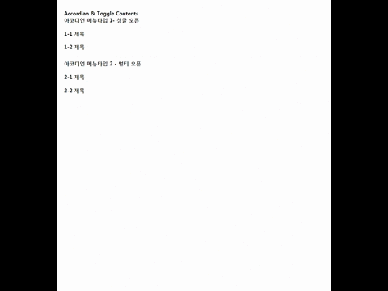
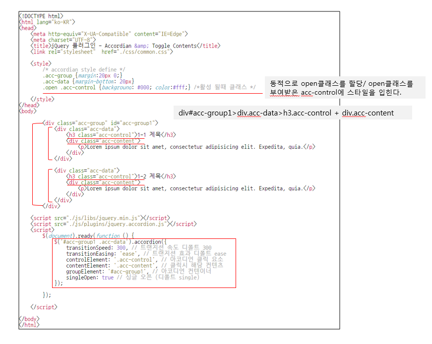

### Accordian Contents


#### Sample Structure


#### example
[view](example.html)
#### Html
````html
<div class="content">
    <h3>아코디언 메뉴타입 1- 싱글 오픈</h3>
    <div class="acc-group" id="acc-group1">
        <div class="acc-data">
            <h3 class="acc-control">1-1 제목</h3>
            <div class="acc-content">
                <div class="contents">
                    <h5>1-1</h5>
                    <p>역시 마찬가지로, 단순히 고통이라는 이유 때문에 고통 그 자체를 사랑하거나 추구하거나 소유하려는 자는 없다. 다만 노역과 고통이 아주 큰 즐거움을 선사하는 상황이 때로는 발생하기 때문에 고통을 찾는 사람이 있는 것이다. 간단한 예를 들자면, 모종의 이익을 얻을 수도 없는데 힘든 육체적 노력을 기꺼이 할 사람이 우리들 중에 과연 있겠는가? 하지만 귀찮은 일이 뒤따르지 않는 즐거움을 누리는 것을 선택한 사람, 혹은 아무런 즐거움도 생기지 않는 고통을 회피하는 사람을 누가 탓할 수 있겠는가?</p>
                </div>
            </div>
        </div>
        <div class="acc-data">
            <h3 class="acc-control">1-2 제목</h3>
            <div class="acc-content">
                <div class="contents">
                    <h5>1-2</h5>
                    <p>역시 마찬가지로, 단순히 고통이라는 이유 때문에 고통 그 자체를 사랑하거나 추구하거나 소유하려는 자는 없다. 다만 노역과 고통이 아주 큰 즐거움을 선사하는 상황이 때로는 발생하기 때문에 고통을 찾는 사람이 있는 것이다. 간단한 예를 들자면, 모종의 이익을 얻을 수도 없는데 힘든 육체적 노력을 기꺼이 할 사람이 우리들 중에 과연 있겠는가? 하지만 귀찮은 일이 뒤따르지 않는 즐거움을 누리는 것을 선택한 사람, 혹은 아무런 즐거움도 생기지 않는 고통을 회피하는 사람을 누가 탓할 수 있겠는가?</p>
                </div>
            </div>
        </div>
    </div>
    <hr>

    <h3>아코디언 메뉴타입 2 - 멀티 오픈</h3>
    <div class="acc-group" id="acc-group2">
        <div class="acc-data">
            <h3 class="acc-control">2-1 제목</h3>
            <div class="acc-content">
                <div class="contents">
                    <h5>2-1</h5>
                    <p>역시 마찬가지로, 단순히 고통이라는 이유 때문에 고통 그 자체를 사랑하거나 추구하거나 소유하려는 자는 없다. 다만 노역과 고통이 아주 큰 즐거움을 선사하는 상황이 때로는 발생하기 때문에 고통을 찾는 사람이 있는 것이다. 간단한 예를 들자면, 모종의 이익을 얻을 수도 없는데 힘든 육체적 노력을 기꺼이 할 사람이 우리들 중에 과연 있겠는가? 하지만 귀찮은 일이 뒤따르지 않는 즐거움을 누리는 것을 선택한 사람, 혹은 아무런 즐거움도 생기지 않는 고통을 회피하는 사람을 누가 탓할 수 있겠는가?</p>
                </div>
            </div>
        </div>
        <div class="acc-data">
            <h3 class="acc-control">2-2 제목</h3>
            <div class="acc-content">
                <div class="contents">
                    <h5>2-2</h5>
                    <p>역시 마찬가지로, 단순히 고통이라는 이유 때문에 고통 그 자체를 사랑하거나 추구하거나 소유하려는 자는 없다. 다만 노역과 고통이 아주 큰 즐거움을 선사하는 상황이 때로는 발생하기 때문에 고통을 찾는 사람이 있는 것이다. 간단한 예를 들자면, 모종의 이익을 얻을 수도 없는데 힘든 육체적 노력을 기꺼이 할 사람이 우리들 중에 과연 있겠는가? 하지만 귀찮은 일이 뒤따르지 않는 즐거움을 누리는 것을 선택한 사람, 혹은 아무런 즐거움도 생기지 않는 고통을 회피하는 사람을 누가 탓할 수 있겠는가?</p>
                </div>
            </div>
        </div>
    </div>

</div>
````

#### Html내 플러그인 호출
````
<script src="./js/libs/jquery.min.js"></script>
<script src="./js/plugins/jquery.accordion.js"></script>
<script>
$(document).ready(function () {
    $('#acc-group1 .acc-data').accordion({
        transitionSpeed: 300, // 트랜지션 속도 디폴트 300
        transitionEasing: 'ease', // 트랜지션 효과 디폴트 ease
        controlElement: '.acc-control', // 아코디언 클릭 요소
        contentElement: '.acc-content', // 클릭시 해당 컨텐츠를 감싸는 블럭
        groupElement: '#acc-group1', // 아코디언 컨텐이너
        singleOpen: true // 싱글 오픈 디폴트 single
    });

    $('#acc-group2 .acc-data').accordion({
        transitionSpeed: 300, // 트랜지션 속도 디폴트 300
        transitionEasing: 'ease', // 트랜지션 효과 디폴트 ease
        controlElement: '.acc-control', // 아코디언 클릭 요소
        contentElement: '.acc-content', // 클릭시 해당 컨텐츠를 감싸는 블럭
        groupElement: '#acc-group1', // 아코디언 컨텐이너
        singleOpen: false // 싱글 오픈 디폴트 single
    });
});
</script>
````

#### Style
````
<style>
    .content{width:800px; margin:50px auto;}
    /* accordian style */
    .acc-group {margin:20px 0;}
    .acc-data {margin-bottom: 20px}
    .acc-content .contents{padding:20px; border: 1px solid #eee;}
    .open .acc-control {background: #000; color:#fff;} /*활성 될때 클래스 */
</style> 
````

#### Otions
Name             | Default                    | Type    | Description
:----------------|:---------------------------|:--------|:-----------
transitionSpeed  | `300`                      | int     | Transition speed on miliseconds.                         
transitionEasing | `'ease'`                   | string  | CSS value for easing.                                    
controlElement   | `'[data-control]'`         | string  | CSS selector for the element acting as a button.
contentElement   | `'[data-content]'`         | string  | CSS selector for the element containing hide/show content. 
groupElement     | `'[data-accordion-group]'` | string  | CSS selector for a parent element containing a group.
singleOpen       | `true`                     | boolean | Opens a single accordion a time.