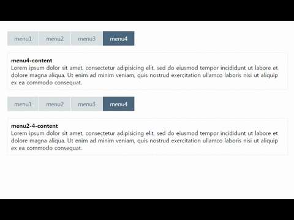
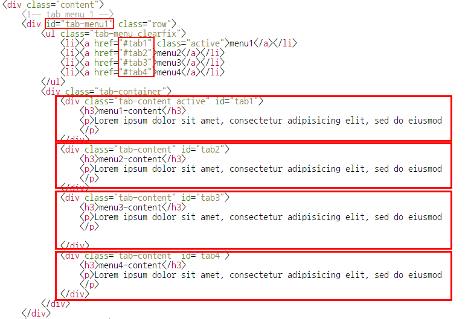

### Tab Menu 플러그인 - 간단, 웹접근성 준수

------------------------------------------------------------------

#### Sample Structure

------------------------------------------------------------------

#### HTML
`````html
<!-- tab menu 1 -->
<div id="tab-menu1" class="row">
    <ul class="tab-menu clearfix">
        <li><a href="#tab1" class="active">menu1</a></li>
        <li><a href="#tab2">menu2</a></li>
        <li><a href="#tab3">menu3</a></li>
        <li><a href="#tab4">menu4</a></li>
    </ul>
    <div class="tab-container">
        <div class="tab-content active" id="tab1">
            <h3>menu1-content</h3>
            <p>Lorem ipsum dolor sit amet, consectetur adipisicing elit, sed do eiusmod
                tempor incididunt ut labore et dolore magna aliqua. Ut enim ad minim veniam,
                quis nostrud exercitation ullamco laboris nisi ut aliquip ex ea commodo
                consequat. Duis aute irure dolor in reprehenderit in voluptate velit esse
                cillum dolore eu fugiat nulla pariatur. Excepteur s
            </p>
        </div>
        <div class="tab-content" id="tab2">
            <h3>menu2-content</h3>
            <p>Lorem ipsum dolor sit amet, consectetur adipisicing elit, sed do eiusmod
                tempor incididunt ut labore et dolore magna aliqua. Ut enim ad minim veniam,
                quis nostrud exercitation ullamco laboris nisi ut aliquip ex ea commodo
                consequat.
            </p>
        </div>
        <div class="tab-content" id="tab3">
            <h3>menu3-content</h3>
            <p>Lorem ipsum dolor sit amet, consectetur adipisicing elit, sed do eiusmod
                tempor incididunt ut labore et dolore magna aliqua. Ut enim ad minim veniam,
                quis nostrud exercitation ullamco laboris nisi ut aliquip ex ea commodo
                consequat. Duis aute irure dolor in reprehenderit in voluptate velit esse
                cillum dolore eu fugiat nulla pariatur. Excepteur sint occaecat cupidatat non
                proident, sunt in culpa qui officia deserunt mollit anim id est laborum.
            </p>
            
        </div>
        <div class="tab-content" id="tab4">
            <h3>menu4-content</h3>
            <p>Lorem ipsum dolor sit amet, consectetur adipisicing elit, sed do eiusmod
                tempor incididunt ut labore et dolore magna aliqua. Ut enim ad minim veniam,
                quis nostrud exercitation ullamco laboris nisi ut aliquip ex ea commodo
                consequat.
            </p>
        </div>
    </div>
</div>
<!-- #tab menu2 -->

<!-- tab menu 1 -->
<div id="tab-menu2">
    <ul class="tab-menu clearfix">
        <li><a href="#tab2-1" class="active">menu1</a></li>
        <li><a href="#tab2-2">menu2</a></li>
        <li><a href="#tab2-3">menu3</a></li>
        <li><a href="#tab2-4">menu4</a></li>
    </ul>
    <div class="tab-container">
        <div class="tab-content active" id="tab2-1">
            <h3>menu2-1-content</h3>
            <p>Lorem ipsum dolor sit amet, consectetur adipisicing elit, sed do eiusmod
                tempor incididunt ut labore et dolore magna aliqua. Ut enim ad minim veniam,
                quis nostrud exercitation ullamco laboris nisi ut aliquip ex ea commodo
                consequat. Duis aute irure dolor in reprehenderit in voluptate velit esse
                cillum dolore eu fugiat nulla pariatur. Excepteur sint occaecat cupidatat non
                proident, sunt in culpa qui officia deserunt mollit anim id est laborum.
            </p>
        </div>
        <div class="tab-content" id="tab2-2">
            <h3>menu2-2-content</h3>
            <p>Lorem ipsum dolor sit amet, consectetur adipisicing elit, sed do eiusmod
                tempor incididunt ut labore et dolore magna aliqua. Ut enim ad minim veniam,
                quis nostrud exercitation ullamco laboris nisi ut aliquip ex ea commodo
                consequat.
            </p>
        </div>
        <div class="tab-content" id="tab2-3">
            <h3>menu2-3-content</h3>
            <p>Lorem ipsum dolor sit amet, consectetur adipisicing elit, sed do eiusmod
                tempor incididunt ut labore et dolore magna aliqua. Ut enim ad minim veniam,
                quis nostrud exercitation ullamco laboris nisi ut aliquip ex ea commodo
                consequat. Duis aute irure dolor in reprehenderit in voluptate velit esse
                cillum dolore eu fugiat nulla pariatur. Excepteur sint occaecat cupidatat non
                proident, sunt in culpa qui officia deserunt mollit anim id est laborum.
            </p>
            
        </div>
        <div class="tab-content" id="tab2-4">
            <h3>menu2-4-content</h3>
            <p>Lorem ipsum dolor sit amet, consectetur adipisicing elit, sed do eiusmod
                tempor incididunt ut labore et dolore magna aliqua. Ut enim ad minim veniam,
                quis nostrud exercitation ullamco laboris nisi ut aliquip ex ea commodo
                consequat.
            </p>
        </div>
    </div>
</div>
<!-- #tab menu2 -->
`````
#### STYLE
````
.tab-menu > li{float: left; background: #d9e0e2; margin-right: 1px}
.tab-menu > li >a {display:block;padding:10px 20px;  color: #4d677d}
.tab-menu > li:hover >a, .tab-menu > li>a.active {background: #4d677d;color: #fff}
.tab-content {border: 1px solid #eee; padding:10px; margin-top: 20px; display: none}
.tab-content.active {display: block}
````

#### Plugin 호출
````
<script src="./js/libs/jquery.min.js"></script>
<script src="./js/plugins/jquery.simpleTabs.js"></script>

<script>
$(document).ready(function () {
    $('#tab-menu1 .tab-menu, #tab-menu2 .tab-menu').simpleTabs({
        'tab_menu': 'li>a', // 클릭 탭 메뉴
        'tab_menu_className': 'active', // 탭메뉴 활성 클래스 명
        'tab_contents': '.tab-content' // 탭 컨텐츠
    });
});
    
</script>
````
#### JS
````
;(function ( global, $) {
  'use strict';
  var pluginName = 'simpleTabs';

  if(!$.fn[pluginName]){
    $.fn[pluginName] = function(options){
        return $.each(this, function(){
        // 플러그인 옵션 설정
        var settings = $.extend({}, $.fn[pluginName].defaults, options);
        var $this = $(this);
        var $tab_contents         = settings.tab_contents,
            $tab_menu             = settings.tab_menu,
            $tab_menu_className   = settings.tab_menu_className;
        
        $this
          .on('click', $tab_menu, function(e){
            e.preventDefault();
            $this.find($tab_menu).removeClass($tab_menu_className);
            $(this).addClass($tab_menu_className);
            $this.next().children($tab_contents).hide();
            var path = e.target.getAttribute('href'); // DOM
            //console.log($(path));
            $(path)
              .show()
              .attr('tabindex', 0)
              .focus()
              .on('blur', function() {
                $(path).attr('tabindex', -1);
              });
          });
      });
    } // plugin
  }

  // 플러그인 기본 옵션 설정
  $.fn[pluginName].defaults = {
    'tab_menu': 'a',
    'tab_menu_className': 'active',
    'tab_contents': 'div'
  };

}(window, window.jQuery));
````

#### Options

Name               | Default                    | Description
:------------------|:---------------------------|:--------------------
tab_menu           | `a`                        | 탭메뉴 클릭 요소                         
tab_menu_className | `'active'`                 | 탭메뉴 활성 클래스명                                    
tab_contents       | `'div'`                    | 탭 컨텐츠 요소